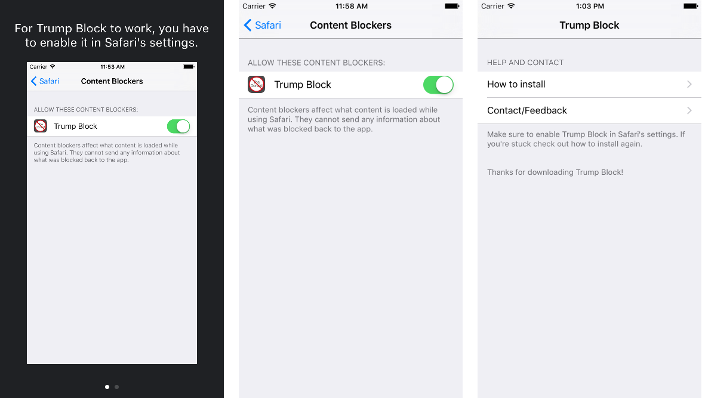

# Trump Block for iOS

This repository contains the code for a Safari iOS 9+ content blocking app intended to block all things Trump.

## About

I was tired of seeing/hearing about Donald Trump in the news and Apple had just released iOS 9 with the new content blocking capabilities, so I decided to build this little simple app to see if I could block anything related to Donald Trump on Safari.

All it does is use iOS content blocking extension to remove any content from Safari that has to do with Donald Trump. I decide against releasing this on the App Store and instead decided to open source it so that anyone can make improvements, use it on their own device, or use it to make something even better.

I think we can all benefit from having a little less of The Donald in our lives.

## How to Use

To use or check the app out, you need to follow these simple steps:

1. Clone the repository
2. Open the project with Xcode.
3. Run the app on your iPhone or the iOS Simulator.
4. You're all set! Make sure to enable the content blocker in iOS Settings > Safari > Content Blockers

## Compatibility

This project is written in Swift 2.0 and uses the content blocking extension which requires Xcode 7 to build and run.

It is compatible with iOS 9+ and iOS devices running arm64.

## Created by

[Alex Meyer](http://twitter.com/alexcmeyer)

## License

Licensed under the MIT License: https://opensource.org/licenses/MIT
